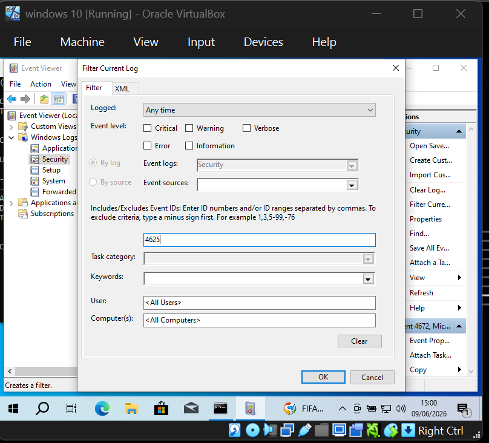
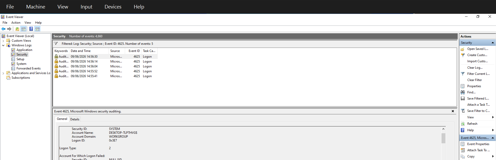
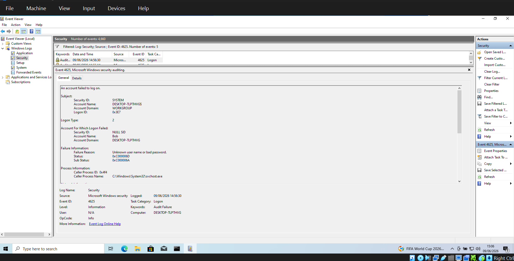
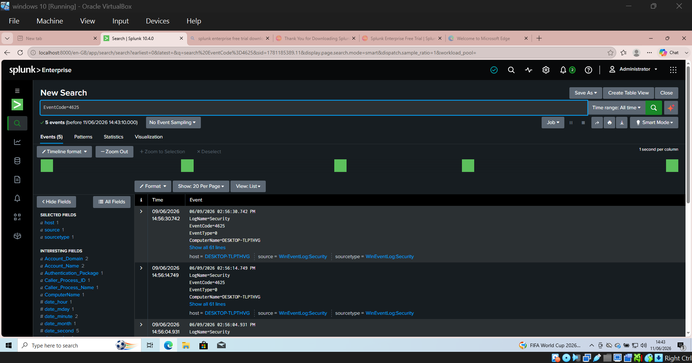
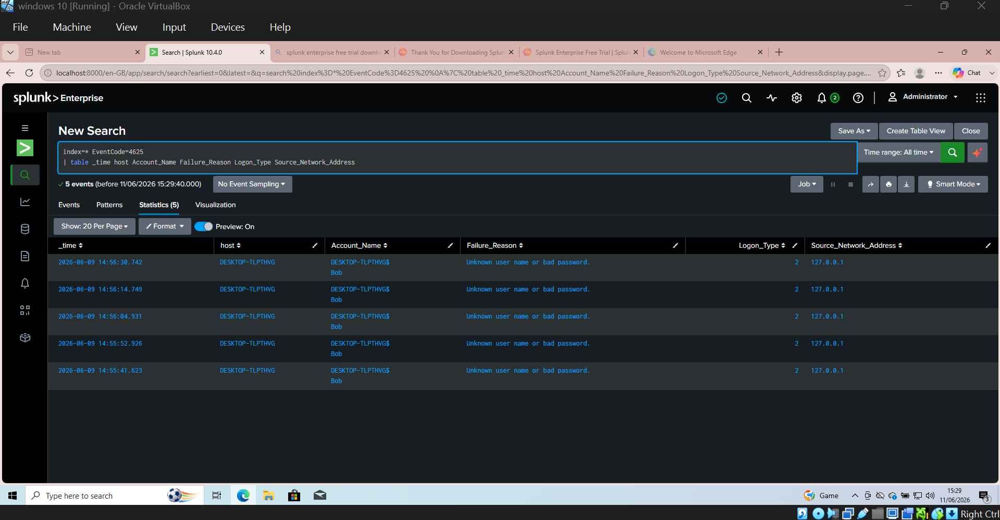
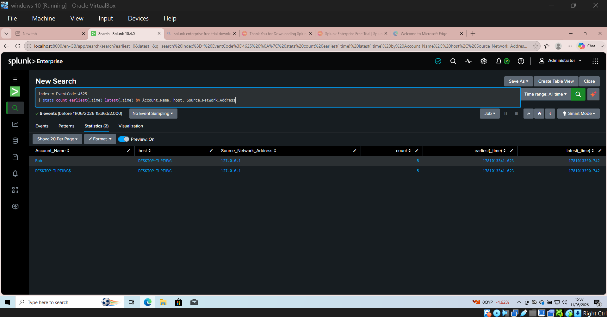

# Incident 001: Failed Login Investigation - Windows Event ID 4625

## Project Overview

This project was created as part of my personal SOC home lab to develop practical experience beyond academic study and build evidence of my SOC investigation skills.

The aim was to practise a basic Tier 1 SOC investigation workflow, including Windows Security log analysis, authentication monitoring, alert investigation, SIEM analysis, evidence collection, risk assessment and incident documentation.

I generated controlled failed login activity on a Windows 10 virtual machine and investigated the resulting Windows Event ID 4625 events using both Windows Event Viewer and Splunk Enterprise.

## Lab Environment

- Windows 10 Virtual Machine
- Oracle VirtualBox
- Windows Event Viewer
- Windows Security Event Logs
- Splunk Enterprise
- Splunk Search Processing Language (SPL)

## Investigation Scenario

Five controlled failed login attempts were generated against a local test account named `Bob`.

The purpose was to investigate how failed authentication attempts appear within Windows Security logs and how the same events can be analysed using a SIEM platform.

### Event Details

- **Event ID:** 4625
- **Event Type:** Failed Logon
- **Log Source:** Windows Security Logs
- **Target Account:** Bob
- **Number of Failed Attempts:** 5
- **Logon Type:** 2 - Interactive Logon
- **Source Network Address:** 127.0.0.1
- **Time Range:** Approximately 14:55 - 14:56

## Windows Event Viewer Investigation

I began the investigation in Windows Event Viewer by navigating to:

`Windows Logs → Security`

I filtered the Security log for **Event ID 4625** to identify failed authentication attempts.

### Evidence - Filtering for Event ID 4625

The Windows Security log was filtered for Event ID 4625 to isolate failed logon activity.



The investigation identified **5 failed login events** associated with the test account `Bob`.

### Evidence - Failed Login Events

The filtered Security log returned five Event ID 4625 events within a short time period.



Analysis of the events showed:

- **Failure Reason:** Unknown user name or bad password
- **Logon Type:** 2 (Interactive)
- **Source Network Address:** 127.0.0.1
- **Failed Attempts:** 5

Logon Type 2 indicated that the authentication attempts were made interactively at the Windows sign-in screen.

The source address `127.0.0.1` is the local loopback address, indicating that the activity originated from the same Windows virtual machine rather than an external network host.

### Evidence - Event 4625 Details

Reviewing the individual event provided additional authentication information, including the target account, failure reason and logon type.



## Splunk SIEM Investigation

After identifying the failed login events in Windows Event Viewer, I investigated the same Windows Security events using **Splunk Enterprise**.

The aim was to practise searching, filtering and summarising security events using Splunk Search Processing Language (SPL).

### Log Ingestion

Splunk Enterprise was configured to collect Windows Security Event Logs from the Windows 10 virtual machine.

The events were ingested using:

- **Source:** WinEventLog:Security
- **Sourcetype:** WinEventLog:Security
- **Host:** DESKTOP-TLPTHVG

### Initial Event Search

I searched for failed login events using:

```spl
EventCode=4625
```

The search returned **5 events**, matching the failed login attempts previously identified in Windows Event Viewer.

### Evidence - Splunk Event Search

The initial Splunk search returned five Event ID 4625 events, matching the activity identified in Windows Event Viewer.



### Detailed Event Analysis

I then used SPL to display the fields relevant to the investigation:

```spl
index=* EventCode=4625
| table _time host Account_Name Failure_Reason Logon_Type Source_Network_Address
```

This allowed me to analyse the event timestamp, affected account, host, failure reason, logon type and source address.

### Evidence - SPL Field Analysis

The selected fields provided a concise view of the five authentication failures and supported comparison of the account, host, failure reason, logon type and source network address.



### Counting Failed Login Attempts

I used the following query to count the failed login events by account:

```spl
index=* EventCode=4625
| stats count by Account_Name
```

The investigation confirmed **5 failed login events** associated with the test account.

### Creating an Event Timeline

I also used SPL to group the events and identify the first and last observed activity:

```spl
index=* EventCode=4625
| stats count earliest(_time) AS first_seen latest(_time) AS last_seen by Account_Name, host, Source_Network_Address
| convert ctime(first_seen) ctime(last_seen)
```

The five failed login attempts occurred within approximately **49 seconds**.

### Evidence - Event Timeline Analysis

The SPL statistics query grouped the failed authentication activity by account, host and source address while identifying the earliest and latest observed events.



## Triage Decision

Based on the investigation, I made the following triage decision:

- **Classification:** True Positive - Benign Test Activity
- **Severity:** Low
- **Disposition:** Closed

The failed login events were genuine authentication failures, meaning the alert was a true positive. However, the activity had been intentionally generated as part of the controlled lab exercise and therefore did not represent malicious activity.

In a real SOC environment, further investigation would include:

- Confirming the activity with the account owner
- Checking for successful logins following the failed attempts
- Reviewing whether the same source targeted additional accounts
- Investigating the source IP address
- Escalating the incident if brute-force or account-compromise behaviour was suspected
